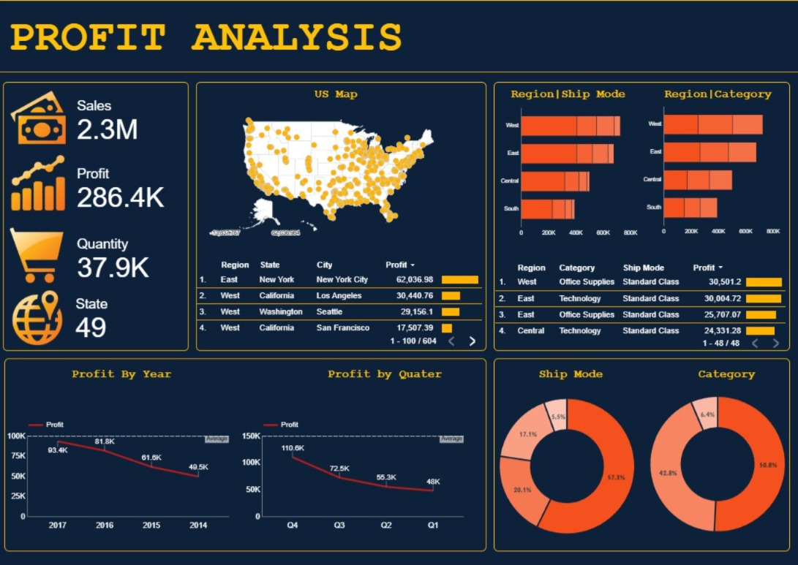

# 📈 US Retail Profit Analysis Dashboard

> **[🚀 VIEW LIVE INTERACTIVE DASHBOARD](https://lookerstudio.google.com/reporting/4474809e-a546-42c0-98a2-30a805f36732)**

---

### ⭐ Project Overview
This project is a deep-dive **Profit Analysis** built using **Google Looker Studio**. It analyzes a retail dataset across 49 US states to identify key revenue drivers, regional performance, and product profitability. The dashboard is designed to help stakeholders move from "seeing numbers" to "making decisions."

### 🛠️ Technical Toolbox
  

---

### 📸 Dashboard Preview
 
*Comprehensive view of sales (2.3M) and profit (286.4K) metrics with regional mapping.*

---

### 🧠 Strategic Business Insights
- 💰 **Financial Summary:** Achieved total sales of **2.3M** with an aggregate profit of **286.4K** across **37.9K units**.
- 📍 **Market Leaders:** The **East** and **West** regions are the strongest profit centers, with **New York City**, **Los Angeles**, and **Seattle** leading as top-contributing cities.
- 📦 **Category Performance:** **Office Supplies** and **Technology** categories, specifically under the **Standard Class** shipping mode, represent the highest profit margins.
- ⚠️ **Trend Alert:** Identified a **year-over-year decline** in profit trends, highlighting a critical need for operational review or market strategy adjustments.
- 🗺️ **Geographic Reach:** Successfully analyzed and visualized data spanning **49 US States**.

---

### 🎯 Dashboard Functionality
- **Regional Profit Mapping:** Interactive US Map to visualize high and low-performing geographic zones.
- **Time-Series Analysis:** Breakdown of profit by **Year** and **Quarter** to monitor growth patterns.
- **Segmentation:** Donut charts and bar graphs for **Ship Mode** and **Product Category** distribution.
- **Top-N Analysis:** Leaderboards for identifying the most profitable states and products at a glance.

---

### 🧪 Data Methodology
1.  **Data Cleaning:** Structured multi-regional sales data for consistent reporting.
2.  **KPI Engineering:** Developed custom metrics for Profit Margin and Quantity-to-Profit ratios.
3.  **Visualization:** Applied a high-contrast dark theme for professional, executive-level readability.

---
[🔙 Back to Portfolio](https://github.com/AmanRobinson)
